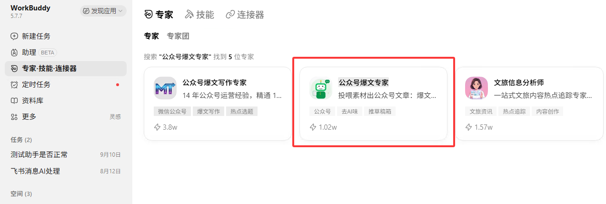

# 公众号 AI 全链路 · WorkBuddy 为主，任何 Agent 都能装

[English](README.en.md) · [今日内容清单](HOT-LIST.md) · [发布页](https://github.com/adsorgcn/WorkBuddy/releases) · [更新记录](UPDATES.md)

市面上的「AI 写公众号」只管写。这里是一条链：每天自动更新的内容清单告诉你各平台在聊什么，公众号的真实阅读分享数据告诉你哪些题还没写爆，然后 AI 写稿、配图、推进草稿箱，你在手机上看一眼再发，发完它回查数据、给你排节奏。人只在两处拍板：定题，审稿。

这套东西以 WorkBuddy 为主（国内版市场里直接加），同时任何能读 `SKILL.md` 的 Agent 都能装：Claude Code、Codex、CodeBuddy 命令行、Hermes、OpenClaw、豆包、Muse 等。唯一要花钱的地方是 wxrank 的 API 额度，你自己去买：https://wxrank.com/api-services 。

## 跟别人不一样在哪

| | 常见的 AI 写公众号 | 这里 |
|---|---|---|
| 管哪一段 | 写 | 选方向、找题、内容清单、写、配图、推草稿箱、回查、节奏，整条 |
| 题从哪来 | 你自己想，或者凭感觉 | 需求侧是仓库每天自动拉的四十多个热点源，供给侧是公众号上这个题读了多少、爆没爆，两边对上才是题 |
| 人干什么 | 全程盯着 | 两次拍板：定题、审稿；发布永远人点 |
| 换工具 | 重来 | 技能是标准 SKILL.md 加标准库脚本，换个 Agent 照用 |
| 花钱 | 平台会员、模型、工具各一份 | 只有 wxrank 的额度，100 积分 1 元，看一次榜 1 积分 |

## 玩法：一条链

| 步 | 干什么 | 谁干 | 用什么 | 交付什么 |
|---|---|---|---|---|
| 1 | 选方向 | AI 比，你定 | 选题技能 `direction`：给 2 到 8 个候选品类词，各看一次榜 | 一张表：命中篇数、最高阅读、中位阅读、10 万加篇数 |
| 2 | 找题 | AI 找，你定 | `feed` 读今日内容清单（免费），`hot` 看公众号上这个题的阅读分享 | 5 条候选题，每条带需求侧和供给侧数据 |
| 3 | 内容清单 | AI 排 | `calendar`：挑题、看榜、按周更节奏排日期 | 一个月的清单，带日期 |
| 4 | 写稿 | AI 写 | 写稿技能：23 条写作基因、12 项自查、去 AI 味 | MD 正文、3 个标题、封面提示词、自查报告 |
| 5 | 配图 | AI 出提示词，图你出或接出图模型 | 封面提示词模板 | 封面加正文图 |
| 6 | 推草稿箱 | AI 推 | 推草稿技能：转微信 HTML、传图、draft/add、回读核对 | 草稿箱里的那篇，media_id |
| 7 | 审稿发表 | 你 | 手机公众号助手 | 发出去的链接 |
| 8 | 回查 | AI 查 | `article` 查单篇阅读在看分享 | 每篇一行数据 |
| 9 | 节奏 | AI 排，你定 | 周更 1 到 2 篇，囤 2 到 3 篇再开 | 周计划 |

每一步的输出是 I-Lang 块，贴进下一步的命令里就行。一台机器、一个 Agent 跑完整条链，手机遥控它。

## 今日内容清单，每天自动更新

[HOT-LIST.md](HOT-LIST.md) 是人读的，`data/hot/latest.json` 是机器读的，每天北京时间早上六点半由 GitHub Actions 自动跑：拉四十多个公开热点源（知乎、微博、抖音、百度、B 站、头条、澎湃、贴吧、参考消息、36 氪、金十、财联社、IT 之家、量子位、少数派、V2EX、HN、Product Hunt 等），跨平台聚类，同一件事几个平台在聊标出来，按 AI、科技、热榜、财经、产品、海外六个方向分组，每个方向 15 条。

源也是自动管的：候选池里能拉到东西、而且这个平台还没有源的，自动加进来；连续 7 天拉不到的自动下线，哪天通了自动恢复。每次增减写在 [UPDATES.md](UPDATES.md)。

你的 Agent 每天一条命令就能拿到清单，不用自己去爬。把下面这段贴给它：

```
::ILANG
[TYPE:command][PROJECT:wechat_awesome][TASK:daily_topics][LANG:zh]

::STATE{@FEED, url:https://raw.githubusercontent.com/adsorgcn/WorkBuddy/main/data/hot/latest.json, what:今天各平台在聊什么 按方向分组 platforms 是几个平台同时在聊}
::STATE{@USER, niche:<你的品类词 一到三个>}
::STATE{@SELF, skill:wechat-topic-hunter}

::OBJECTIVE{daily_topics|pri:OVERRIDE_ALL}
  target: 用 feed 读 @FEED 挑出跟我品类有关的 5 条 再用 hot 查每条在公众号上的阅读和分享 给我一份带两边数据的选题清单
  ACCEPT: 5 条 每条有来源 平台数 公众号最高阅读 篇数 还没写爆的标出来 独家栏空着我填
  NON_GOALS: 替我定题 搬运原文 没报价就扣积分
```

## 装法

### WorkBuddy 国内版（主路线）

市场里搜「公众号爆文专家」，点下图红框那个。绿色小机器人头像，标签「公众号 去AI味 推草稿箱」。旁边那个「公众号爆文写作专家」不是。



市场版自带写稿和推草稿两个技能。选题技能市场里没有，从 [发布页](https://github.com/adsorgcn/WorkBuddy/releases) 下 `wechat-topic-hunter` 开头的 zip，解压后在 Skills 面板「上传技能」选那个文件夹，再分配给专家。

### WorkBuddy 海外版

海外版看不到国内市场。先说一个坑：海外版的自定义模型只认 OpenAI 兼容接口，Claude 协议的接口填不进去。用自带模型，或者接一个 OpenAI 兼容的中转站。

**装法一：贴一条命令，让 WorkBuddy 自己装。** 新开一个对话，整段复制贴进去。它会去发布页下包、把技能装进自己的技能目录、按专家正文建专家、挂上技能。它自己装不了的那一步会告诉你在界面上点哪里。

```
::ILANG
[TYPE:command][PROJECT:wechat_awesome][TASK:install][LANG:zh]

::STATE{@USER, role:owner, has:WorkBuddy 桌面端}
::STATE{@SELF, role:installer, runtime:WorkBuddy 桌面端 任意对话, can:Bash Read Write WebFetch}
::STATE{@PACKAGE, url:https://github.com/adsorgcn/WorkBuddy/releases 最新版里文件名以 ilang-wechat-awesome-workbuddy-expert 开头的 zip, has:解压后一个 ilang-wechat-awesome 文件夹 里面 agents 一份专家正文 skills 四个技能文件夹 avatars 一张头像}
::STATE{@TARGET, skills:你自己的技能目录 四个文件夹各放一份, expert:用 agents 里那份 md 去掉开头两行 --- 之间的设置 建一个专家 名字 公众号爆文专家 头像 avatars 里那张 挂上技能}
::STATE{@OUT, kind:装完报告, items:技能在不在技能列表 专家建没建 怎么切进专家对话}

::OBJECTIVE{install|pri:OVERRIDE_ALL}
  target: 把包下下来 装进你自己 装不了的那一步告诉我在界面上点哪里 装完报告
  ACCEPT: 技能在技能列表里 专家建好且设定里有 [PROJECT:wechat_awesome]
  NON_GOALS: 改专家正文 改技能内容 碰我的任何密钥

::RULE{下载⇒用 WebFetch 或 curl 从 @PACKAGE 的地址下 本机打不开 GitHub 就停下告诉我 我自己下好把路径给你}
::RULE{技能目录装不进⇒告诉我去 Skills 面板 Add skill 然后 Upload skill 选解压后 skills 下的文件夹 一个一个传}
::RULE{专家建不了⇒告诉我去专家页 创建专家 把 agents 正文整段粘进去 名字 公众号爆文专家 挂上技能}
::BOUNDARY{never:改动包里任何文件的内容|scope:permanent}

::MODULE{HOW}
  [STEP:1] 下包 解压 列出 agents 文件和技能文件夹的路径
  [STEP:2] 装技能 装完看技能列表 报哪几个在
  [STEP:3] 建专家 建完告诉我怎么切进它的对话
  [STEP:4] 报告 然后让我在专家对话里贴下面「装完自检」那条
```

**装法二：手动三步。** 发布页下最新的 `ilang-wechat-awesome-workbuddy-expert-*.zip` 解压；Skills 面板 Add skill → Upload skill，依次选 `skills/` 下的文件夹；专家页「我的专家」→「创建专家」，把 `agents/ilang-wechat-awesome.md` 开头两行 `---` 之间那段跳过、其余整段粘进专家提示词，名字填「公众号爆文专家」，头像用 `avatars/expert.png`，分配技能。界面上的字以你看到的为准。

### 其他 Agent

技能是标准 `SKILL.md` 加纯标准库的 Python 脚本，专家正文是一份 Markdown。装进任何 Agent 都是两件事：技能文件夹拷进它的技能目录，专家正文放进它的人设文件。

| Agent | 技能文件夹放哪 | 专家正文放哪 |
|---|---|---|
| CodeBuddy 命令行 | `~/.codebuddy/skills/`，或 `/plugin marketplace add adsorgcn/WorkBuddy` 再 `/plugin install ilang-wechat-awesome@ilang-workbuddy` | 项目的 `CODEBUDDY.md` |
| Claude Code | `~/.claude/skills/`，或项目的 `.claude/skills/` | 项目的 `CLAUDE.md` |
| Codex | `~/.codex/skills/` | 项目的 `AGENTS.md` |
| Hermes | `~/.hermes/skills/` | `SOUL.md` 里加一段 |
| OpenClaw | `~/.openclaw/skills/` 或工作区的 `skills/`，`openclaw skills list` 能看到实际目录 | 它的 agent 设定 |
| 豆包 | 技能页「自定义新建技能」，把 `SKILL.md` 的内容贴进去 | 智能体设定里贴正文 |
| Muse | Muse Code 认标准 `SKILL.md` 目录 | 助理设定里贴正文 |
| 其他 | 能读 `SKILL.md` 的，拷进它的技能目录；不能的，把 `SKILL.md` 全文当提示词贴 | 系统提示里贴正文 |

专家正文在 `experts/ilang-wechat-awesome/agents/ilang-wechat-awesome.md`，开头两行 `---` 之间是 WorkBuddy 的设置，别的 Agent 跳过那段。脚本要机器上有 Python 3.8 以上，不用装任何包。路径写得不对，Agent 自己会找，第一次跑给它一句「技能在哪个目录」就行。

### 唯一要花钱的：wxrank

供给侧的数据来自 wxrank（微小榜）的公众号接口，用你自己的 key。买额度：https://wxrank.com/api-services ，注册和充值：https://data.wxrank.com ，100 积分等于 1 元，看一次榜 1 积分，日上限默认 300 积分。key 写进用户主目录的 `.wxrank.env`，一行 `KEY=你的key`，脚本自己读，不要贴进任何对话。

接口哪台机器都能连，国内海外都一样，我们从十四台不同地区的机器上测过。连不上是你那台机器自己的网络问题。

可选的第二笔钱：封面和配图想让 AI 直接出，接一个 OpenAI 兼容的出图接口，比如 apikey.fun 的 gpt-image-2。不接也行，专家会给你封面提示词，你自己出图。

### 装完自检

切进专家的对话，整段贴进去。

```
::ILANG
[TYPE:command][PROJECT:wechat_awesome][TASK:env_check][LANG:zh]

::STATE{@USER, role:owner}
::STATE{@SELF, role:checker, runtime:专家对话, can:Read Bash Glob}
::STATE{@OUT, kind:自检报告, items:五项 专家 模型 技能文件 技能绑定 wxrank}

::OBJECTIVE{env_check|pri:OVERRIDE_ALL}
  target: 核五项 缺的告诉我怎么补 能跑的自己跑
  ACCEPT: 五项各一行 有 或 缺 最后一行 全部就绪 或 还缺几项
  NON_GOALS: 替我填任何密钥 猜没核过的状态

::RULE{检查靠跑命令或读文件⇒不靠猜 跑不了的写 没核到}
::RULE{密钥⇒只看文件在不在 不读内容 不复述}

::MODULE{HOW}
  [STEP:1] 看你自己的设定里有没有 [PROJECT:wechat_awesome] 有就报 VERSION 后面的版本号 没有写 缺
  [STEP:2] 一句话证明模型在回话 说清用的是自带模型还是自定义模型
  [STEP:3] Glob 找 **/wechat-article/SKILL.md **/wechat-draft-push/scripts/wechat_draft.py **/wechat-topic-hunter/scripts/wxrank_topics.py 在下载目录或桌面的不算 那只是包
  [STEP:4] 看本对话能用的技能列表里有没有这三个
  [STEP:5] 用户主目录有没有 .wxrank.env 有就跑选题技能的 balance 报余额 没有写 缺
  [STEP:6] 五项各一行 项目 有或缺 怎么补
```

安装非官方技能前，先看一遍源码和权限。这里的脚本都是纯 Python 标准库、凭据从本机配置文件读：推草稿技能的 `wechat_draft.py` 只调微信官方接口，发布命令只在人说「发」之后对认证号可用，没有删草稿命令；选题技能的 `wxrank_topics.py` 只读调用 wxrank，花积分前报价；`hot_sources.py` 只读公开的 RSS 和接口。

## 技能清单

| 名称 | 是什么 | 版本 |
|---|---|---|
| [公众号爆文专家](experts/ilang-wechat-awesome/) | 专家正文。投喂素材，按 200 多篇实战文章验证的写作基因重组，出 MD 正文、3 个标题、封面图提示词；没素材不写，不编数字不编经历。带下面四个技能 | 2.3.8 |
| [选题对标 wechat-topic-hunter](experts/ilang-wechat-awesome/skills/wechat-topic-hunter/) | `feed` 读每日清单（免费），`direction` 比方向，`calendar` 排内容清单，`hot` 看榜，找号、对标、单篇数据；每次花积分前先报价。附 `hot_sources.py`，上不了 GitHub 时自己拉热点源 | 2.3.8 |
| [写稿 wechat-article](experts/ilang-wechat-awesome/skills/wechat-article/) | 23 条写作基因，六段式和八区块两种骨架，标题四个公式，12 项自查，去 AI 味三件套和五个信号，脱敏表和敏感词红线，封面提示词模板 | 2.3.8 |
| [推草稿箱 wechat-draft-push](experts/ilang-wechat-awesome/skills/wechat-draft-push/) | check 验凭据和白名单，render 转微信 HTML，push 传图传封面推进草稿箱并回读，verify 回读，publish 只在人看完草稿说「发」后对微信认证号可用。外链自动收进文末「参考链接」，留言开关和「阅读原文」可设。没有删草稿命令 | 2.3.8 |
| [远程派活 remote-dispatch](experts/ilang-wechat-awesome/skills/remote-dispatch/) | 可选件。两台机器的人用：本机当总控，把 [RUN:VPS] 的命令块派给远程机上的 CodeBuddy 网关跑，收回结果。远程机起网关的脚本在 scripts 里，Linux 和 Windows 各一个 | 2.3.8 |

## 怎么用

```
第 1 步  说「今天写什么」或贴上面那条每日命令 → 它读清单、查数据，给 5 条题 → 你选一条，补一句独家
第 2 步  贴素材（经历 / 数据 / 笔记 / 文件路径），说「写成公众号爆文」→ 它确认角度和骨架 → 你选
第 3 步  它出提纲和 3 个标题 → 你确认
第 4 步  它写初稿，去 AI 味，12 项自查 → 你审改：补个人经历、填口语位、补截图
第 5 步  说「推草稿箱」，它转微信 HTML、传图、推进草稿箱 → 你在手机公众号助手里看一眼再发
第 6 步  发完把链接给它，它查阅读在看分享，排下一篇
```

素材是别人的知识，文章是你的观点。没独家的题，专家会建议你不写。

## 它不做的事

- 没素材不写
- 不编数字、引语、个人经历
- 不引导点赞转发收藏关注
- 不在文章里放网址和个人微信号
- 不碰政治、赌博、色情、翻墙类话题
- 不做矩阵号、批量操作、搬运洗稿
- 不自动发布：发布永远人点，或人说「发」之后认证号由接口点最后那一下
- 不用于规避各平台对 AI 辅助内容的披露要求

## 这个仓库怎么自己动

- 每天北京时间 06:30，Actions 跑 `scripts/update_hot_list.py`：拉源、聚类、写清单、管源，提交到主分支。
- 主分支一有提交，Actions 跑 `scripts/release.py`：版本号升一个小号、把版本同步到所有文件、跑门禁 `scripts/build_packages.py`、打五个 zip、打 tag、建 release，发版说明自动写这次改了什么、今天的清单多少条。所以发布页天天有新版，装最新的就行。
- 门禁检查：版本一致、frontmatter 齐、IML 工作链用官方编译器回环、无长破折号、无效果承诺、引用文件齐、脚本能编译。没过不发版。

## 协议

专家正文和技能用 iLang 协议写，开头那行 `#iml/0.5/...` 是它的机器层 IML 0.5 工作链，用官方编译器回环验证过：

```
[PARS:@USER]=>[GET:@SRC]=>[DRFT|sty=casual]=>[CHEK]=>[SAVE:@DST|grp=date]=>[Ω]
#iml/0.5/7e29fae7f5ea PS@US GT@SR DRst=casual CK SV@DSgr=date $
```

| 资源 | 地址 |
|---|---|
| iLang 官网 | ilang.ai |
| iLang 中文站 | ilang.cn |
| 公众号排版工具 | ilang.cn/md |
| 协议正典 | github.com/ilang-ai/ilang-spec |
| 机器层 IML | github.com/ilang-ai/iml-protocol |

## 更新记录

每日清单的增减在 [UPDATES.md](UPDATES.md)，每个版本改了什么在 [发布页](https://github.com/adsorgcn/WorkBuddy/releases)。大版本：

- 2.3.6（2026-10-10）：改成任何 Agent 都能装的公众号全链路。新增每日内容清单（`data/hot/latest.json`、`HOT-LIST.md`，Actions 每天自动拉四十多个源、跨平台聚类、自动加源和下线）和更新即发版；选题技能加 `feed`（免费读清单）、`direction`（方向比较）、`calendar`（内容清单）三个命令，热点源脚本并入选题技能；README 按 Agent 分别写装法，写明唯一要花钱的是 wxrank 额度、接口哪台机器都能连。
- 2.3.5（2026-10-09）：远程派活补齐远程机那一半：`setup-gateway.sh`（Linux）和 `setup-gateway.ps1`（Windows）一键起 CodeBuddy 网关；派出正文前加 `::NOTE{via:remote-dispatch …}`；允许本机按用户指明填 [FILL] 行。
- 2.3.4（2026-10-09）：推草稿箱：外链收进文末「参考链接」（`--no-cite` 关）；`--comment`、`--source-url`；`tunnel` 子命令借远程机 IP 过白名单；错误码表补全。写稿自查加「AI 味五个信号」。
- 2.3.3（2026-10-09）：新增远程派活技能 remote-dispatch。
- 2.3.2（2026-10-09）：安装说明分国内版和海外版，加「装完自检」。
- 2.3.1（2026-10-09）：专家改名「公众号爆文专家」。
- 2.3.0（2026-10-09）：新增选题对标技能 wechat-topic-hunter，用用户自己的 wxrank key。
- 2.2.0（2026-10-09）：推草稿箱技能加 publish 命令，只在人看完草稿说「发」后对认证号可用。
- 2.1.0（2026-10-08）：新增推草稿箱技能。
- 2.0.0（2026-10-08）：从国内市场版 1.2.0 升级，基因 23 条，内置去 AI 味，iLang v5.0 头加 IML 0.5 工作链。
- 1.2.0（2026-09-02）：国内 WorkBuddy 市场上架版。

## 许可

MIT · © 2026 静水流深
